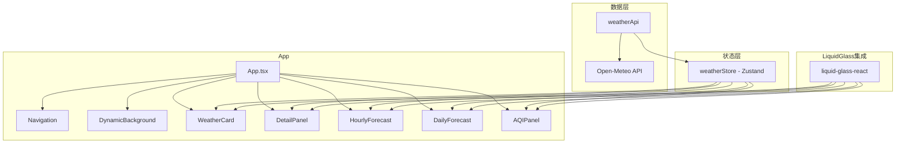

# Apple Liquid Glass 天气应用 - 技术架构文档

## 1. 技术栈

- **前端框架**：React 18 + TypeScript
- **构建工具**：Vite
- **样式方案**：Tailwind CSS v3 + CSS Variables
- **状态管理**：Zustand
- **图标库**：lucide-react
- **玻璃态组件**：集成 liquid-glass-react 库
- **天气数据**：Open-Meteo API（免费，无需 API Key）
- **包管理器**：pnpm（若存在）或 npm

## 2. 项目结构

```
weather-app/
├── src/
│   ├── components/           # 组件目录
│   │   ├── GlassCard.tsx     # Liquid Glass 玻璃态卡片组件
│   │   ├── WeatherCard.tsx    # 主天气卡片
│   │   ├── DetailPanel.tsx    # 天气详情面板
│   │   ├── HourlyForecast.tsx # 小时预报组件
│   │   ├── DailyForecast.tsx  # 每日预报组件
│   │   ├── AQI Panel.tsx      # 空气质量面板
│   │   ├── CitySearch.tsx     # 城市搜索组件
│   │   ├── CityList.tsx       # 城市列表组件
│   │   ├── DynamicBackground.tsx  # 动态背景组件
│   │   └── Navigation.tsx     # 导航栏组件
│   ├── hooks/                # 自定义 Hooks
│   │   ├── useWeather.ts      # 天气数据 Hook
│   │   ├── useGeocoding.ts    # 地理编码 Hook
│   │   └── useLocalStorage.ts # 本地存储 Hook
│   ├── store/                # Zustand 状态管理
│   │   └── weatherStore.ts    # 天气状态存储
│   ├── services/             # API 服务
│   │   └── weatherApi.ts      # 天气 API 调用
│   ├── types/                # TypeScript 类型定义
│   │   └── weather.ts         # 天气相关类型
│   ├── utils/                # 工具函数
│   │   ├── weatherIcons.tsx   # 天气图标映射
│   │   └── formatters.ts      # 数据格式化函数
│   ├── App.tsx               # 主应用组件
│   ├── main.tsx              # 入口文件
│   └── index.css             # 全局样式
├── public/
│   └── favicon.ico
├── index.html
├── package.json
├── tsconfig.json
├── vite.config.ts
├── tailwind.config.js
└── postcss.config.js
```

## 3. 核心组件架构



## 4. API 定义

### 4.1 天气数据 API

**Endpoint**: `https://api.open-meteo.com/v1/forecast`

**请求参数**：
```typescript
interface WeatherRequest {
  latitude: number;
  longitude: number;
  current: string[];      // ['temperature_2m', 'relative_humidity_2m', 'apparent_temperature', 'weather_code', 'wind_speed_10m']
  hourly: string[];       // ['temperature_2m', 'weather_code']
  daily: string[];        // ['weather_code', 'temperature_2m_max', 'temperature_2m_min']
  timezone: string;        // 'auto'
  forecast_days: number;   // 7
}
```

**响应数据**：
```typescript
interface WeatherResponse {
  current: {
    temperature_2m: number;
    relative_humidity_2m: number;
    apparent_temperature: number;
    weather_code: number;
    wind_speed_10m: number;
  };
  hourly: {
    time: string[];
    temperature_2m: number[];
    weather_code: number[];
  };
  daily: {
    time: string[];
    weather_code: number[];
    temperature_2m_max: number[];
    temperature_2m_min: number[];
  };
}
```

### 4.2 地理编码 API

**Endpoint**: `https://geocoding-api.open-meteo.com/v1/search`

**请求参数**：
```typescript
interface GeocodingRequest {
  name: string;
  count?: number;
  language?: string;
  format?: string;
}
```

**响应数据**：
```typescript
interface GeocodingResponse {
  results: Array<{
    id: number;
    name: string;
    latitude: number;
    longitude: number;
    country: string;
    admin1?: string;
  }>;
}
```

### 4.3 空气质量 API

**Endpoint**: `https://air-quality-api.open-meteo.com/v1/air-quality`

**请求参数**：
```typescript
interface AQIRequest {
  latitude: number;
  longitude: number;
  current: string[];  // ['us_aqi', 'pm2_5', 'pm10', 'ozone', 'nitrogen_dioxide', 'sulphur_dioxide', 'carbon_monoxide']
}
```

## 5. 数据模型

### 5.1 天气状态模型

```typescript
interface WeatherState {
  cities: City[];
  currentCity: City | null;
  weatherData: Record<number, WeatherData>;
  aqiData: Record<number, AQIData>;
  loading: boolean;
  error: string | null;
}

interface City {
  id: number;
  name: string;
  latitude: number;
  longitude: number;
  country: string;
  timezone: string;
}

interface WeatherData {
  current: CurrentWeather;
  hourly: HourlyWeather[];
  daily: DailyWeather[];
  lastUpdated: Date;
}

interface CurrentWeather {
  temperature: number;
  apparentTemperature: number;
  humidity: number;
  weatherCode: number;
  windSpeed: number;
}

interface HourlyWeather {
  time: string;
  temperature: number;
  weatherCode: number;
}

interface DailyWeather {
  date: string;
  weatherCode: number;
  tempMax: number;
  tempMin: number;
}

interface AQIData {
  usAqi: number;
  pm25: number;
  pm10: number;
  ozone: number;
  nitrogenDioxide: number;
  sulphurDioxide: number;
  carbonMonoxide: number;
}
```

### 5.2 本地存储结构

```typescript
interface StoredData {
  cities: City[];
  lastSelectedCityId: number;
}
```

## 6. 天气代码映射

| 代码 | 描述 | 图标 |
|------|------|------|
| 0 | 晴朗 | Sun |
| 1-3 | 多云 | CloudSun, Cloud |
| 45, 48 | 雾 | CloudFog |
| 51-57 | 毛毛雨 | CloudDrizzle |
| 61-67 | 小雨到中雨 | CloudRain |
| 71-77 | 雪 | CloudSnow |
| 80-82 | 阵雨 | CloudRain |
| 85-86 | 阵雪 | CloudSnow |
| 95-99 | 雷暴 | CloudLightning |

## 7. 组件规格

### 7.1 Liquid Glass 玻璃态配置

```typescript
const glassConfig = {
  displacementScale: 50,
  blurAmount: 0.08,
  saturation: 150,
  aberrationIntensity: 1.5,
  elasticity: 0.1,
  cornerRadius: 28,
};
```

### 7.2 响应式断点

| 设备 | 断点 | 布局 |
|------|------|------|
| 手机 | < 768px | 单列全宽卡片 |
| 平板 | 768px - 1024px | 双列卡片 |
| 桌面 | > 1024px | 三列布局，左侧主卡片 |

## 8. 性能优化

- 天气数据缓存：5分钟自动刷新
- 图片懒加载：小时预报图标
- 骨架屏：数据加载中显示
- 防抖：城市搜索输入
